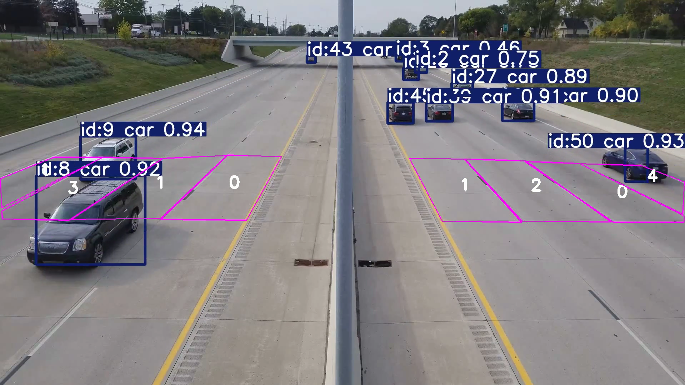
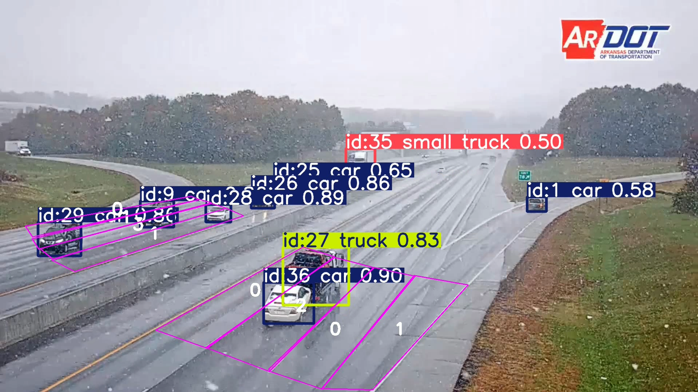
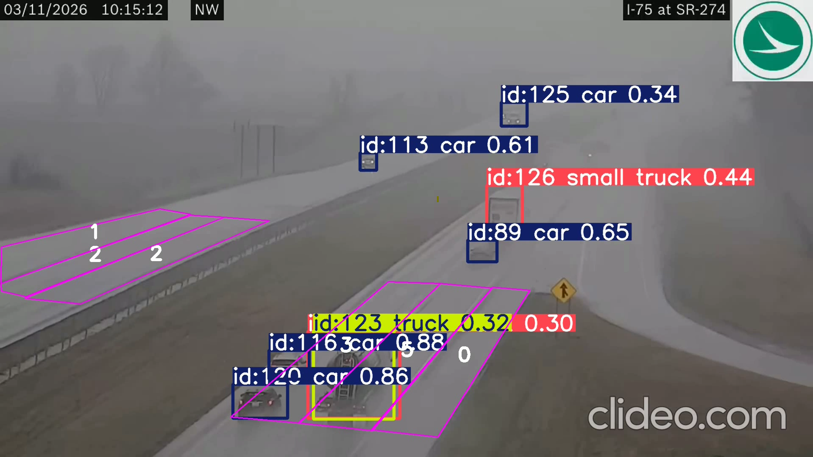
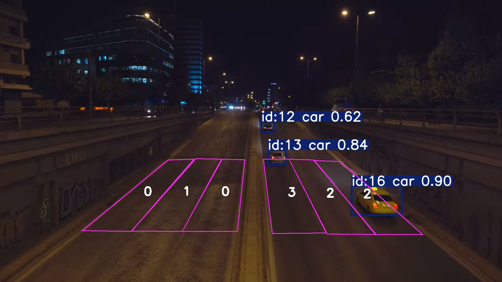

# 🚦 Nhận diện và đếm số lượng phương tiện giao thông trong các điều kiện thời tiết khắc nghiệt
# Traffic Counting under Extreme Weather Conditions

This repository contains the implementation of the traffic tracking and counting system for my project. The model is built using **YOLO11** and **ByteTrack**, specifically fine-tuned to handle challenging weather conditions (heavy rain, snow, night) using the TSBOW dataset.

## 🌟 Demo Results

| Normal Condition | Snow |
| :---: | :---: |
|  |  |
| **Heavy Rain** | **Night** |
|  |  |

🎥 **[Watch the Full Demo Videos on Google Drive](https://drive.google.com/drive/folders/14Hu13czW0Rk6GKdDjDTyFmpvDpZVDor2?usp=sharing)**

## ✨ Key Features
- **YOLO11m Architecture:** Optimized for detecting small and highly occluded vehicles.
- **ByteTrack Integration:** Maintains consistent tracking IDs even when confidence drops due to extreme weather.
- **Virtual ID Suppression (Ghost-filtering):** A custom dynamic bounding-box logic to strictly prevent double-counting and ID-switching.

## 📂 Project Structure
The repository consists of three main scripts:
- `train.ipynb`: Used to train the YOLO11m model on the TSBOW dataset. It includes specific hyperparameter configurations (e.g., `imgsz=1280`) optimized for small objects and extreme weather conditions.
- `test.ipynb`: Evaluates the trained model on the TSBOW test set, generating objective metrics (Precision, Recall, mAP50 and mAP50-95).
- `demo.ipynb`: Runs the full pipeline (Detection + Tracking + Counting) on custom videos. It features the polygon-based ROI checking and the Virtual ID Suppression logic to filter out double predictions.

## 🛠️ Installation
```bash
# Install required packages
pip install -r requirements.txt
```

## ⚖️ License & Acknowledgments
**1. Codebase Copyright:**
**© 2026 To Quang Han. All Rights Reserved.**
The source code (training scripts, object tracking, counting logic) in this repository is provided strictly for academic review and portfolio demonstration purposes. Any commercial use, reproduction, modification, or distribution without explicit written permission from the author is strictly prohibited.

**2. Dataset License & Attribution:**
This project utilizes the **TSBOW (Traffic Surveillance Benchmark for Occluded Vehicles)** dataset for training and evaluation.

- **Creators:** Automation Lab, Department of Electrical and Computer Engineering, Sungkyunkwan University.
- **Paper:** [TSBOW: Traffic Surveillance Benchmark for Occluded Vehicles Under Various Weather Conditions (AAAI-26)](https://ojs.aaai.org/index.php/AAAI/article/view/37439)
- **License:** The TSBOW dataset is distributed under the [Creative Commons Attribution-NonCommercial-NoDerivatives 4.0 International (CC BY-NC-ND 4.0)](https://creativecommons.org/licenses/by-nc-nd/4.0/) license.
- **Disclaimer:** This repository does NOT distribute or host the TSBOW dataset or its derivative weights. To access the dataset, please visit the official Hugging Face repository provided by the authors. This project is strictly for non-commercial, academic research purposes.
